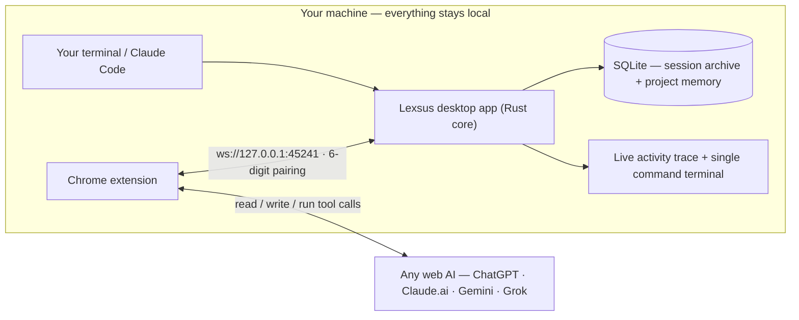

<div align="center">

# Lexsus
 
**Your AI can change. Your work doesn't.**

[](https://github.com/abdulwasea89/lexsus/stargazers)
[](LICENSE)
[](https://github.com/abdulwasea89/lexsus/actions)
[](src-tauri)
[](src)
[](src-tauri)
[](extension)

**[简体中文](README.zh-CN.md) · English**

A local-first Tauri + Rust desktop app and Chrome extension that turns any **web AI — ChatGPT, Claude, Gemini, Grok — into a real coding agent on your machine**. When your local agent (like Claude Code) hits its usage limit, crashes, or you just want to switch, Lexsus captures your real project state and hands the work off — so the web AI can **read your files, write files, and run terminal commands**, and you never re-explain the project.

</div>

---

## Key Features

| | Feature | What it means for you |
|---|---|---|
| 🔀 | **Handoff, not copy-paste** | One click packages the real state of your project — objective, decisions, failed attempts, constraints, changed files — into a prompt any web AI can continue from. Facts, not chat. |
| 🛠️ | **Real coding-agent tools** | The web AI gets 15 tools — reads (chunked), precise edits (`edit_file`, `multi_edit`, `apply_patch`), file management (`delete_file`, `move_file`, `copy_file`, `create_directory`), `run_command` — executed locally by the Rust core, not simulated in the browser. It discovers them with `list_tools` and `describe_tool`, so a chat can be primed without a handoff. |
| 👁️ | **Live activity trace** | Every read, write, and command the web AI performs shows up in real time, cross-checked against the filesystem watcher — nothing is claimed without evidence. |
| 🛡️ | **Approval gates + session grants** | Writes, commands, and destructive calls (`delete_file`, `move_file` — the card shows the resolved absolute path) pause for your **Allow / Deny**. Tick "don't ask again" to grant a class of edits for the session; the kill switch revokes every grant and pauses the bridge. Every command streams live into the app's single read-only terminal so you see exactly what runs. |
| 🧠 | **Structured project memory** | Sessions are archived to embedded SQLite and distilled into objective, decisions, failed attempts, constraints, changed files, and heuristic progress. |
| 🗂️ | **Full git workflow** | Status, diff, staging, branches, history, and **commit from the app** — powered by `git2`, no external git process. |
| 🔒 | **Local-first by design** | Everything runs on your machine: embedded SQLite, loopback-only WebSocket (`127.0.0.1`) with 6-digit pairing, and a minimal Tauri surface instead of Electron. |

## How It Works

Two bridges, four layers — from raw capture to a delivered handoff.



1. **Capture** — the app records real file, git, and terminal activity into a lossless Session Archive (Layer 1).
2. **Structure** — the archive is distilled into facts, not chat: objective, decisions, failed attempts, constraints, changed files (Layer 2).
3. **Compress** — an optional Python/FastAPI service summarizes the state into a handoff-sized snapshot for a fresh context window (Layer 3).
4. **Deliver** — the Handoff Engine formats it for your chosen web AI and establishes the coding-agent bridge through the extension (Layer 4).

Full detail in [docs/architecture.md](docs/architecture.md).

## Quick Start

**Prerequisites:** Node.js 20+, Rust (stable), [pnpm](https://pnpm.io), Chrome/Edge (for the extension). Python 3.12 is only needed for the optional compression service.

```bash
git clone https://github.com/abdulwasea89/lexsus.git
cd lexsus
pnpm install
pnpm tauri dev
```

Load the extension (Chrome/Edge):

1. Open `chrome://extensions` and enable **Developer mode**.
2. Click **Load unpacked** and select the `extension/` folder.
3. In the Lexsus desktop app, copy the **6-digit pairing code** and enter it in the extension popup — the bridge connects over loopback WebSocket.

Optional — the LLM context-compression service (Layer 3):

```bash
docker compose up -d            # or run it directly:
pip install -r compression-service/requirements.txt
uvicorn main:app --port 8000 --app-dir compression-service
```

## Usage

### 1. Pair and watch

With the extension paired, open a project in the desktop app. The **live activity trace** shows every action the web AI takes; each approved `run_command` streams into the single read-only terminal and lands in the git panel where you can commit from the app.

### 2. Hand off, not log out

Hit your local agent's limit? Trigger a handoff from the app. It packages the extracted facts and injects them as opening context in the web AI's chat — the AI inherits *why*, not just *what*, so it won't retry dead ends.

### 3. The web AI works like an agent

The extension detects tool calls in the web chat and relays them to the Rust core over the local WebSocket:

```jsonc
{
  "id": "a1b2c3d4-e5f6-7890-abcd-ef1234567890",
  "type": "tool_call",
  "tool": "read_file",
  "arguments": { "path": "src/App.tsx", "offset": 401 }
}
```

Large files come back one chunk at a time as numbered lines, with a footer
naming the exact call that returns the next chunk — the AI pages through what it
needs instead of being handed a whole file it can't absorb. `run_command` output
streams back chunk-by-chunk and the write/run tools wait for your **Allow /
Deny** before touching disk or shell. The full wire protocol is specified in
[docs/protocol-v2.md](docs/protocol-v2.md).

> [!NOTE]
> **Status:** early-stage MVP — the core bridge works end-to-end (archive, facts, handoff, tool relay, live terminal). The compression service (`/compress`) is still a stub; a [5–10 developer validation](requirements/mvp-scope.md) comes before scaling features.

## Repository Layout

```
├── src/                    # React + TypeScript frontend (Tauri shell)
├── src-tauri/              # Rust core — git2, portable-pty, notify, rusqlite, local WebSocket
├── extension/              # Chrome MV3 extension (ChatGPT · Claude.ai · Gemini · Grok)
├── compression-service/    # Optional Python FastAPI context compression (Layer 3)
├── docs/                   # Architecture, protocol v2, tech stack, UI design
├── requirements/           # Product requirements, MVP scope, trade-offs
├── ongoing/                # Active work logs and runbooks
└── public/                 # Static web assets
```

## Documentation & Learning Paths

Reading the docs in this order takes you from "what is this" to "how the wire works":

| # | Doc | Covers |
|---|---|---|
| 1 | [docs/architecture.md](docs/architecture.md) | The two bridges and four layers |
| 2 | [docs/tech-stack.md](docs/tech-stack.md) | Tauri + Rust systems stack, security rationale |
| 3 | [docs/protocol-v2.md](docs/protocol-v2.md) | Wire protocol, tool definitions, error codes, sequence diagrams |
| 4 | [docs/ui-design.md](docs/ui-design.md) | The control-center UI: activity trace, terminal, git panel |
| 5 | [docs/tool-roadmap.md](docs/tool-roadmap.md) | The 44-tool surface, phase by phase: built vs planned, and the invariants |
| 6 | [requirements/product-requirements.md](requirements/product-requirements.md) | Product & MVP scope, success criteria |
| 7 | [ongoing/facts-and-archive.md](ongoing/facts-and-archive.md) | Completed work: session archive (F2) + fact extraction (F3) |

## Contributing

Contributions are welcome — the CI already enforces quality on every PR (frontend lint/typecheck/build, `cargo fmt`/`clippy`/tests, service health check).

1. **Fork** the repo and create a branch (`git checkout -b feat/your-idea`).
2. **Make your change** — keep it focused, add a test where reasonable.
3. **Open a pull request** — existing tests run automatically and must pass.

Check the [issues](https://github.com/abdulwasea89/lexsus/issues) for easy entry points. Note: there's no CONTRIBUTING.md yet — if you'd like to drive its conventions, start a discussion.

## Community & Support

- 💬 Ask questions and propose features in [GitHub Discussions](https://github.com/abdulwasea89/lexsus/discussions).
- 🐛 Report bugs via [issues](https://github.com/abdulwasea89/lexsus/issues).
- ⭐ Enjoy the project? **Star the repo** — it's the fastest way to help the bridge reach more developers.

## License

Released under the [MIT License](LICENSE). Built with [Tauri](https://tauri.app), [React](https://react.dev), the [Rust](https://www.rust-lang.org) ecosystem (`git2`, `portable-pty`, `rusqlite`, `notify`, `tungstenite`), and [FastAPI](https://fastapi.tiangolo.com).
