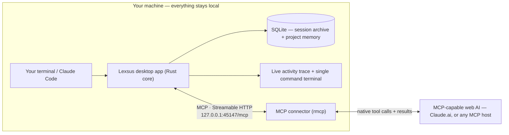

<div align="center">

# Lexsus
 
**Your AI can change. Your work doesn't.**

[](https://github.com/abdulwasea89/lexsus/stargazers)
[](LICENSE)
[](https://github.com/abdulwasea89/lexsus/actions)
[](src-tauri)
[](src)
[](src-tauri)
[](src-tauri/src/mcp.rs)

**[简体中文](README.zh-CN.md) · English**

A local-first Tauri + Rust desktop app that turns an **MCP-capable web AI — Claude.ai, or any MCP host — into a real coding agent on your machine**. When your local agent (like Claude Code) hits its usage limit, crashes, or you just want to switch, Lexsus captures your real project state and hands the work off — so the web AI can **read your files, write files, and run terminal commands**, and you never re-explain the project.

</div>

---

## Key Features

| | Feature | What it means for you |
|---|---|---|
| 🔌 | **Native MCP connector, not scraping** | Your web AI talks to Lexsus through its **own tool channel** — a desktop-local MCP server on `http://127.0.0.1:45147/mcp`. Native tool UI, native results, no browser extension, no DOM watching, no composer injection. |
| 🔀 | **Handoff, not copy-paste** | One click packages the real state of your project — objective, decisions, failed attempts, constraints, changed files — into a prompt any web AI can continue from. Facts, not chat. |
<<<<<<< HEAD
| 🛠️ | **Real coding-agent tools** | The web AI gets 27 tools — reads (chunked), precise edits (`edit_file`, `multi_edit`, `apply_patch`), file management (`delete_file`, `move_file`, `copy_file`, `create_directory`), `run_command`, search (`grep`, `glob`), and a full git workflow — executed locally by the Rust core, not simulated in the browser. It discovers them with `list_tools` and `describe_tool`, so a chat can be primed without a handoff. |
=======
| 🛠️ | **Real coding-agent tools** | 15 tools so far — reads (chunked), precise edits (`edit_file`, `multi_edit`, `apply_patch`), file management (`delete_file`, `move_file`, `copy_file`, `create_directory`), `run_command` — executed locally by the Rust core, not simulated in the browser. The AI discovers them with `list_tools` and `describe_tool`, so a chat can be primed without a handoff. |
>>>>>>> 15b86747d260d728cb108d11ca09c9706c5c764b
| 👁️ | **Live activity trace** | Every read, write, and command the web AI performs shows up in real time, cross-checked against the filesystem watcher — nothing is claimed without evidence. |
| 🛡️ | **Approval gates + session grants** | Writes, commands, and destructive calls (`delete_file`, `move_file` — the card shows the resolved absolute path) pause for your **Allow / Deny**. Tick "don't ask again" to grant a class of edits for the session; the kill switch revokes every grant and pauses the bridge. Every command streams live into the app's single read-only terminal so you see exactly what runs. |
| 🚦 | **Read-only first** | The connector exposes read tools only until you flip "Allow writes & commands" — live, from the desktop, no rebuild and no reconnect. |
| 🧠 | **Structured project memory** | Sessions are archived to embedded SQLite and distilled into objective, decisions, failed attempts, constraints, changed files, and heuristic progress. |
| 🗂️ | **Full git workflow** | Status, diff, staging, branches, history, and **commit from the app** — powered by `git2`, no external git process. |
| 🔒 | **Local-first by design** | The connector binds to loopback only, embedded SQLite, and a minimal Tauri surface instead of Electron. Nothing leaves the machine unless you deliberately expose it. |

## How It Works

One connector, four layers — from raw capture to a delivered handoff.



1. **Capture** — the app records real file, git, and terminal activity into a lossless Session Archive (Layer 1).
2. **Structure** — the archive is distilled into facts, not chat: objective, decisions, failed attempts, constraints, changed files (Layer 2).
3. **Compress** — an optional Python/FastAPI service summarizes the state into a handoff-sized snapshot for a fresh context window (Layer 3).
4. **Deliver** — the Handoff Engine formats it for your chosen web AI, and the native MCP connector gives that AI real tools against the local project (Layer 4).

Full detail in [docs/architecture.md](docs/architecture.md).

## Quick Start

**Prerequisites:** Node.js 20+, Rust (stable), [pnpm](https://pnpm.io). Python 3.12 is only needed for the optional compression service.

```bash
git clone https://github.com/abdulwasea89/lexsus.git
cd lexsus
pnpm install
pnpm tauri dev
```

When the app starts, the connector binds `http://127.0.0.1:45147/mcp` — the status bar shows `connector · ro` (read-only) and the **Web-AI connector** view shows the exact endpoint and bound workspace.

Connect a web AI:

1. **Claude.ai** — Customize → Connectors → **Add custom connector**, and give it the endpoint. Claude.ai connects from Anthropic's cloud, so in development expose the loopback server through a short-lived HTTPS tunnel (see [docs/connector-native-proof-runbook.md](docs/connector-native-proof-runbook.md)); add that tunnel's host to the DNS-rebinding allowlist with `LEXSUS_MCP_ALLOWED_HOSTS=your-tunnel.example.com`.
2. **A local MCP host** (Claude Code, Claude Desktop, the MCP Inspector) — point it straight at `http://127.0.0.1:45147/mcp`. No tunnel needed.

The connector starts **read-only**. Flip **Allow writes & commands** in the Web-AI connector view (or launch with `LEXSUS_MCP_ALLOW_WRITE=1`) when you want the write and command tools exposed — every one of them still asks for your approval on the desktop.

Optional — the LLM context-compression service (Layer 3):

```bash
docker compose up -d            # or run it directly:
pip install -r compression-service/requirements.txt
uvicorn main:app --port 8000 --app-dir compression-service
```

## Usage

### 1. Connect and watch

Open a project in the desktop app and connect your web AI. The **live activity trace** shows every action it takes; each approved `run_command` streams into the single read-only terminal and lands in the git panel where you can commit from the app.

### 2. Hand off, not log out

Hit your local agent's limit? Build a handoff from the app. It packages the extracted facts — objective, decisions, failed attempts, constraints, changed files — and copies them for the web AI's chat, so the AI inherits *why*, not just *what*, and won't retry dead ends.

> [!NOTE]
> The connector is **pull-based**: MCP has no way to push a message into a chat, so today the handoff is surfaced in-app and copied to your clipboard. A `get_handoff` connector tool — letting the AI pull the handoff itself — is the next step.

### 3. The web AI works like an agent

The AI calls Lexsus tools through its own native tool channel. Underneath, that is an MCP `tools/call`:

```jsonc
{
  "jsonrpc": "2.0",
  "id": 1,
  "method": "tools/call",
  "params": {
    "name": "read_file",
    "arguments": { "path": "src/App.tsx", "offset": 401 }
  }
}
```

Large files come back one chunk at a time as numbered lines, with a footer naming the exact call that returns the next chunk — the AI pages through what it needs instead of being handed a whole file it can't absorb. `run_command` output streams back chunk-by-chunk, and the write/run tools block on your **Allow / Deny** on the desktop before touching disk or shell. Results are capped at 140,000 characters, in the same truncated-marker style as everything else. The full wire protocol is specified in [docs/protocol-v2.md](docs/protocol-v2.md).

> [!NOTE]
> **Status:** early-stage MVP — the core bridge works end-to-end (archive, facts, handoff, tool relay, live terminal). The compression service (`/compress`) is still a stub; a [5–10 developer validation](requirements/mvp-scope.md) comes before scaling features.

## Repository Layout

```
├── src/                    # React + TypeScript frontend (Tauri shell)
├── src-tauri/              # Rust core — git2, portable-pty, notify, rusqlite, native MCP server
│   └── src/mcp.rs          # the connector: rmcp Streamable HTTP on loopback
├── compression-service/    # Optional Python FastAPI context compression (Layer 3)
├── docs/                   # Architecture, connector protocol, tech stack, UI design, tool roadmap
├── requirements/           # Product requirements, MVP scope, trade-offs
├── ongoing/                # Active work logs and runbooks
└── public/                 # Static web assets
```

## Documentation & Learning Paths

Reading the docs in this order takes you from "what is this" to "how the wire works":

| # | Doc | Covers |
|---|---|---|
| 1 | [docs/architecture.md](docs/architecture.md) | The connector and the four layers |
| 2 | [docs/tech-stack.md](docs/tech-stack.md) | Tauri + Rust systems stack, security rationale |
| 3 | [docs/protocol-v2.md](docs/protocol-v2.md) | Connector protocol, tool schemas, approvals, error codes, sequence diagrams |
| 4 | [docs/ui-design.md](docs/ui-design.md) | The control-center UI: activity trace, terminal, git panel |
| 5 | [docs/tool-roadmap.md](docs/tool-roadmap.md) | The tool surface, phase by phase: built vs planned, and the invariants |
| 6 | [docs/connector-native-proof-runbook.md](docs/connector-native-proof-runbook.md) | Exposing the connector and proving natively with Claude.ai |
| 7 | [requirements/product-requirements.md](requirements/product-requirements.md) | Product & MVP scope, success criteria |
| 8 | [ongoing/facts-and-archive.md](ongoing/facts-and-archive.md) | Completed work: session archive (F2) + fact extraction (F3) |

## Contributing

Contributions are welcome — the CI already enforces quality on every PR (frontend lint/typecheck/build, `cargo fmt`/`clippy`, compression-service health).

1. **Fork** the repo and create a branch (`git checkout -b feat/your-idea`).
2. **Make your change** — keep it focused, add a test where reasonable.
3. **Open a pull request** — CI runs automatically and must pass.

Adding a tool? Read the invariants in [docs/tool-roadmap.md](docs/tool-roadmap.md) first: a new tool is registered once in `SPECS` (`src-tauri/src/bridge.rs`) with a matching JSON Schema, and the read-only/write gate must keep hiding it until you allow writes.

Check the [issues](https://github.com/abdulwasea89/lexsus/issues) for easy entry points. Note: there's no CONTRIBUTING.md yet — if you'd like to drive its conventions, start a discussion.

## Community & Support

- 💬 Ask questions and propose features in [GitHub Discussions](https://github.com/abdulwasea89/lexsus/discussions).
- 🐛 Report bugs via [issues](https://github.com/abdulwasea89/lexsus/issues).
- ⭐ Enjoy the project? **Star the repo** — it's the fastest way to help the bridge reach more developers.

## License

Released under the [MIT License](LICENSE). Built with [Tauri](https://tauri.app), [React](https://react.dev), the [Rust](https://www.rust-lang.org) ecosystem (`git2`, `portable-pty`, `rusqlite`, `notify`, `rmcp`), and [FastAPI](https://fastapi.tiangolo.com).
