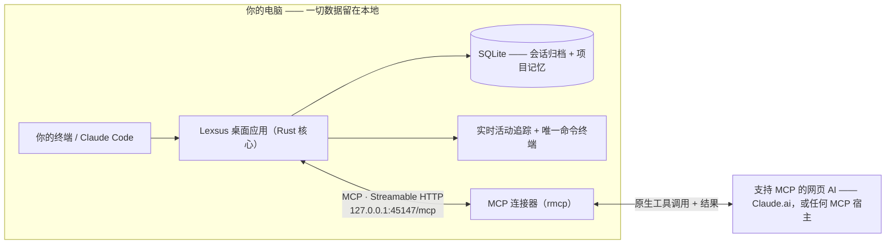

<div align="center">

# Lexsus
 
**你的 AI 可以换，你的工作成果不会丢。**

[](https://github.com/abdulwasea89/lexsus/stargazers)
[](LICENSE)
[](https://github.com/abdulwasea89/lexsus/actions)
[](src-tauri)
[](src)
[](src-tauri)
[](src-tauri/src/mcp.rs)

**简体中文** · [English](README.md)

一款本地优先的 Tauri + Rust 桌面应用，能把**支持 MCP 的网页 AI —— Claude.ai，或任何 MCP 宿主 —— 变成一台真正在你机器上工作的编码智能体**。当本地编码智能体（如 Claude Code）用量耗尽、崩溃，或你只是想换个工具时，Lexsus 会捕获你真实的项目状态并完成交接，让网页 AI 可以**读取文件、写入文件、运行终端命令**，而你永远不必重新解释一遍项目。

</div>

---

## 核心特性

| | 特性 | 对你的意义 |
|---|---|---|
| 🔌 | **原生 MCP 连接器，而非抓取** | 你的网页 AI 通过它**自己的工具通道**与 Lexsus 通信——一个运行在桌面本地的 MCP 服务器，地址为 `http://127.0.0.1:45147/mcp`。原生工具界面、原生结果，没有浏览器扩展，没有 DOM 监听，也不做输入框注入。 |
| 🔀 | **交接，而不是复制粘贴** | 一键把项目真实状态——目标、决策、失败尝试、约束、改动文件——打包成任何网页 AI 都能接手的提示词。是「事实」，不是聊天记录。 |
| 🛠️ | **真正的编码智能体工具** | 目前已有 15 个工具——读取（分块）、精确编辑（`edit_file`、`multi_edit`、`apply_patch`）、文件管理（`delete_file`、`move_file`、`copy_file`、`create_directory`）、`run_command`——全部由本地 Rust 核心真实执行，而非浏览器里的模拟。AI 可以通过 `list_tools` 与 `describe_tool` 自行发现它们，因此无需交接也能为一轮对话备好工具。 |
| 👁️ | **实时活动追踪** | 网页 AI 的每一次读、写、执行都会实时显现，并与文件系统监听交叉校验，所有动作都有实证。 |
| 🛡️ | **操作审批门控 + 会话级授权** | 写入、执行以及破坏性调用（`delete_file`、`move_file`——卡片上会显示解析后的绝对路径）都会暂停，等待你的**允许 / 拒绝**。勾选「不再询问」即可为本次会话授予某一类编辑权限；急停开关会撤销所有授权并暂停桥接。每条命令都会实时流入应用内唯一只读终端，运行什么一目了然。 |
| 🚦 | **只读优先** | 在你开启「允许写入与命令」之前，连接器只暴露读取类工具——可在桌面端实时切换，无需重新构建，也无需重连。 |
| 🧠 | **结构化项目记忆** | 会话被归档到内嵌 SQLite，并提炼出目标、决策、失败尝试、约束、改动文件与启发式进度。 |
| 🗂️ | **完整 Git 工作流** | 状态、Diff、暂存、分支、历史，并且**可直接在应用内提交**——基于 `git2`，无需外部 git 进程。 |
| 🔒 | **本地优先设计** | 连接器只绑定回环地址，配合内嵌 SQLite 与比 Electron 更精简的 Tauri 外壳。除非你刻意对外暴露，否则任何数据都不会离开本机。 |

## 工作原理

一个连接器，四个层级——从原始捕获到完成交接。



1. **捕获**——应用将真实的文件、Git 与终端活动记录为无损的会话归档（第 1 层）。
2. **结构化**——把归档提炼为事实而非聊天：目标、决策、失败尝试、约束、改动文件（第 2 层）。
3. **压缩**——可选的 Python/FastAPI 服务把状态压缩成适合新上下文窗口的交接快照（第 3 层）。
4. **交付**——交接引擎按所选网页 AI 格式化内容，并让原生 MCP 连接器为该 AI 提供针对本地项目的真实工具（第 4 层）。

完整细节见 [docs/architecture.md](docs/architecture.md)。

## 快速开始

**前置要求：** Node.js 20+、Rust（stable）、[pnpm](https://pnpm.io)。Python 3.12 仅用于可选的压缩服务。

```bash
git clone https://github.com/abdulwasea89/lexsus.git
cd lexsus
pnpm install
pnpm tauri dev
```

应用启动后，连接器会绑定 `http://127.0.0.1:45147/mcp`——状态栏显示 `connector · ro`（只读），**Web-AI 连接器**视图会显示确切的端点与已绑定的工作区。

接入网页 AI：

1. **Claude.ai**——Customize → Connectors → **Add custom connector**，填入该端点。Claude.ai 是从 Anthropic 云端发起连接的，因此开发阶段需要用一条短时 HTTPS 隧道把回环服务器暴露出去（见 [docs/connector-native-proof-runbook.md](docs/connector-native-proof-runbook.md)）；再用 `LEXSUS_MCP_ALLOWED_HOSTS=your-tunnel.example.com` 把这条隧道的主机名加入 DNS 重绑定允许列表。
2. **本地 MCP 宿主**（Claude Code、Claude Desktop、MCP Inspector）——直接指向 `http://127.0.0.1:45147/mcp` 即可，无需隧道。

连接器启动时是**只读**的。当你想暴露写入与命令类工具时，在 Web-AI 连接器视图中打开**允许写入与命令**（或以 `LEXSUS_MCP_ALLOW_WRITE=1` 启动）——它们中的每一个仍然需要你在桌面端批准。

可选——LLM 上下文压缩服务（第 3 层）：

```bash
docker compose up -d            # 或直接本地运行：
pip install -r compression-service/requirements.txt
uvicorn main:app --port 8000 --app-dir compression-service
```

## 使用指南

### 1. 连接并观察

在桌面应用中打开一个项目并接入你的网页 AI。**实时活动追踪**会显示它执行的每一个动作；每条获准的 `run_command` 都会流入唯一只读终端，并进入 Git 面板，你可直接在应用内提交。

### 2. 交接，而不是重头再来

本地智能体用量耗尽？从应用中构建一次交接。它会打包提炼出的事实——目标、决策、失败尝试、约束、改动文件——并复制到网页 AI 的对话中，AI 继承的是「为什么」，而不只是「做了什么」，因此不会重试已被证明的失败路径。

> [!NOTE]
> 连接器是**拉取式**的：MCP 无法把消息推入对话，因此目前交接内容在应用内展示并复制到你的剪贴板。一个 `get_handoff` 连接器工具——让 AI 自行拉取交接内容——是下一步的工作。

### 3. 让网页 AI 真正像一个智能体工作

网页 AI 通过它自己的原生工具通道调用 Lexsus 工具。底层其实是一次 MCP `tools/call`：

```jsonc
{
  "jsonrpc": "2.0",
  "id": 1,
  "method": "tools/call",
  "params": {
    "name": "read_file",
    "arguments": { "path": "src/App.tsx", "offset": 401 }
  }
}
```

大文件会以带行号的形式逐块返回，末尾的页脚会指出取回下一块的确切调用——AI 按需翻页，而不是被塞进一整份它无法消化的文件。`run_command` 的输出同样逐块回传；写入与执行类工具会先等待你在桌面端的**允许 / 拒绝**，之后才真正触碰磁盘或 Shell。返回结果上限为 140,000 个字符，并与其他所有内容一样带有截断标记。完整的线上协议见 [docs/protocol-v2.md](docs/protocol-v2.md)。

> [!NOTE]
> **状态：** 早期 MVP——核心桥接已端到端可用（归档、事实提取、交接、工具转发、实时终端）。压缩服务（`/compress`）仍是桩实现；接下来会先完成 [5–10 名开发者验证](requirements/mvp-scope.md)，再扩展更多功能。

## 仓库结构

```
├── src/                    # React + TypeScript 前端（Tauri 外壳）
├── src-tauri/              # Rust 核心 —— git2、portable-pty、notify、rusqlite、原生 MCP 服务器
│   └── src/mcp.rs          # 连接器：回环上的 rmcp Streamable HTTP
├── compression-service/    # 可选 Python FastAPI 上下文压缩服务（第 3 层）
├── docs/                   # 架构、连接器协议、技术栈、UI 设计、工具路线图
├── requirements/           # 产品需求、MVP 范围、取舍记录
├── ongoing/                # 进行中的工作日志与运行手册
└── public/                 # 静态 Web 资源
```

## 文档与学习路径

按以下顺序阅读，你可以从「这是什么」一路看到「线上协议如何运作」：

| # | 文档 | 覆盖内容 |
|---|---|---|
| 1 | [docs/architecture.md](docs/architecture.md) | 连接器与四个层级 |
| 2 | [docs/tech-stack.md](docs/tech-stack.md) | Tauri + Rust 系统栈与安全考量 |
| 3 | [docs/protocol-v2.md](docs/protocol-v2.md) | 连接器协议、工具定义、审批、错误码、时序图 |
| 4 | [docs/ui-design.md](docs/ui-design.md) | 控制中心 UI：活动追踪、终端、Git 面板 |
| 5 | [docs/tool-roadmap.md](docs/tool-roadmap.md) | 工具界面逐阶段展开：已建与待建，以及各项约束 |
| 6 | [docs/connector-native-proof-runbook.md](docs/connector-native-proof-runbook.md) | 暴露连接器，并用 Claude.ai 完成原生验证 |
| 7 | [requirements/product-requirements.md](requirements/product-requirements.md) | 产品与 MVP 范围、成功标准 |
| 8 | [ongoing/facts-and-archive.md](ongoing/facts-and-archive.md) | 已完成工作：会话归档（F2）+ 事实提取（F3） |

## 参与贡献

欢迎任何贡献——CI 已为每个 PR 强制执行质量检查（前端 lint/typecheck/build、`cargo fmt`/`clippy`、压缩服务健康检查）。

1. **Fork** 本仓库并新建分支（`git checkout -b feat/your-idea`）。
2. **完成你的改动**——保持聚焦，合理处补充测试。
3. **提交 Pull Request**——CI 会自动运行且必须通过。

要新增工具？请先阅读 [docs/tool-roadmap.md](docs/tool-roadmap.md) 中的各项约束：新工具只需在 `SPECS`（`src-tauri/src/bridge.rs`）中注册一次，并附带匹配的 JSON Schema，而只读/写入门控必须在允许写入之前始终隐藏它。

可在 [issues](https://github.com/abdulwasea89/lexsus/issues) 中找到适合新手的入口。目前还没有 CONTRIBUTING.md——如果你想推动相关规范，欢迎发起讨论。

## 社区与支持

- 💬 在 [GitHub Discussions](https://github.com/abdulwasea89/lexsus/discussions) 提问与提议新功能。
- 🐛 通过 [issues](https://github.com/abdulwasea89/lexsus/issues) 反馈问题。
- ⭐ 喜欢这个项目？**给仓库点个 Star**——这是让这座桥梁触达更多开发者的最快方式。

## 开源许可

基于 [MIT License](LICENSE) 发布。使用 [Tauri](https://tauri.app)、[React](https://react.dev)、[Rust](https://www.rust-lang.org) 生态（`git2`、`portable-pty`、`rusqlite`、`notify`、`rmcp`）与 [FastAPI](https://fastapi.tiangolo.com) 构建。
