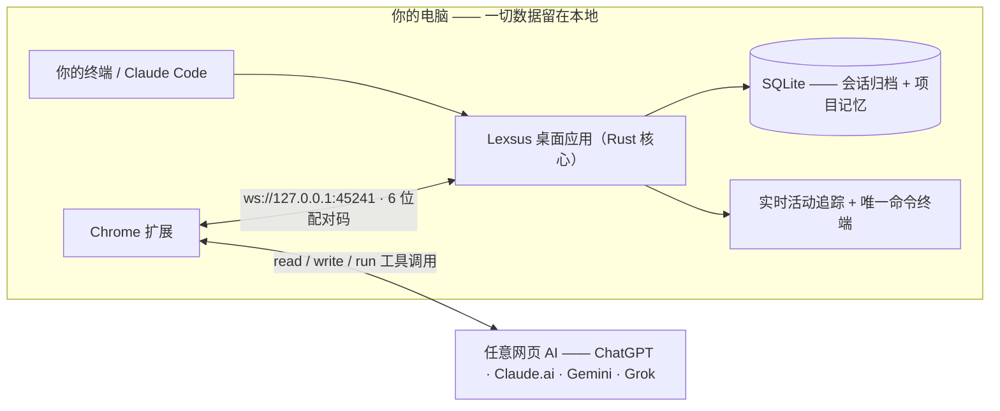

<div align="center">
 
# Lexsus — 人工智能连续性桥梁（AI Continuity Bridge）

**你的 AI 可以换，你的工作成果不会丢。**

[](https://github.com/abdulwasea89/lexsus/stargazers)
[](LICENSE)
[](https://github.com/abdulwasea89/lexsus/actions)
[](src-tauri)
[](src)
[](src-tauri)
[](extension)

**简体中文（默认）** · [English](README.md)

一款本地优先的 Tauri + Rust 桌面应用与 Chrome 扩展，能把任意**网页版 AI —— ChatGPT、Claude、Gemini、Grok —— 变成一台真正在你机器上工作的编码智能体**。当本地编码智能体（如 Claude Code）用量耗尽、崩溃，或你只是想换个工具时，Lexsus 会捕获你真实的项目状态并完成交接，让网页 AI 可以**读取文件、写入文件、运行终端命令**，而你永远不必重新解释一遍项目。

</div>

---

## 核心特性

| | 特性 | 对你的意义 |
|---|---|---|
| 🔀 | **交接，而不是复制粘贴** | 一键把项目真实状态打包成任何网页 AI 都能接手的提示词，包含目标、决策、失败尝试、约束与改动文件。是「事实」，不是聊天记录。 |
| 🛠️ | **真正的编码智能体工具** | 网页 AI 拥有 `read_file`、`write_file`、`run_command`、`list_directory`、`search_files`、`git_status`，全部由本地 Rust 核心真实执行，而非浏览器里的模拟。 |
| 👁️ | **实时活动追踪** | 网页 AI 的每一次读、写、执行都会实时显现，并与文件系统监听交叉校验，所有动作都有实证。 |
| 🛡️ | **操作审批门控** | `write_file` 与 `run_command` 会暂停等待你的**允许 / 拒绝**。每条命令都会实时流入应用内唯一只读终端，运行什么一目了然。 |
| 🧠 | **结构化项目记忆** | 会话被归档到内嵌 SQLite，并提炼出目标、决策、失败尝试、约束、改动文件与启发式进度。 |
| 🗂️ | **完整 Git 工作流** | 状态、Diff、暂存、分支、历史，并且**可直接在应用内提交**——基于 `git2`，无需外部 git 进程。 |
| 🔒 | **本地优先设计** | 一切都在本机运行：内嵌 SQLite、仅回环 WebSocket（`127.0.0.1`）+ 6 位配对码，以及比 Electron 更精简的 Tauri 外壳。 |

## 工作原理

两条桥梁，四个层级——从原始捕获到完成交接。



1. **捕获**——应用将真实的文件、Git 与终端活动记录为无损的会话归档（第 1 层）。
2. **结构化**——把归档提炼为事实而非聊天：目标、决策、失败尝试、约束、改动文件（第 2 层）。
3. **压缩**——可选的 Python/FastAPI 服务把状态压缩成适合新上下文窗口的交接快照（第 3 层）。
4. **交付**——交接引擎按所选网页 AI 格式化内容，并通过扩展建立编码智能体桥梁（第 4 层）。

完整细节见 [docs/architecture.md](docs/architecture.md)。

## 快速开始

**前置要求：** Node.js 20+、Rust（stable）、[pnpm](https://pnpm.io)、Chrome/Edge（扩展用）。可选：Python 3.12（压缩服务）。

```bash
git clone https://github.com/abdulwasea89/lexsus.git
cd lexsus
pnpm install
pnpm tauri dev
```

加载扩展（Chrome/Edge）：

1. 打开 `chrome://extensions`，开启「开发者模式」。
2. 点击「加载已解压的扩展程序」，选择 `extension/` 目录。
3. 在 Lexsus 桌面应用中复制**6 位配对码**，在扩展弹窗中填入——桥梁通过回环 WebSocket 建立连接。

可选——LLM 上下文压缩服务（第 3 层）：

```bash
docker compose up -d            # 或直接本地运行：
pip install -r compression-service/requirements.txt
uvicorn main:app --port 8000 --app-dir compression-service
```

## 使用指南

### 1. 配对并观察

扩展配对完成后，在桌面应用中打开项目。**实时活动追踪**会显示网页 AI 的每一步操作；每条获准的 `run_command` 都会流入唯一只读终端，并进入 Git 面板，你可直接在应用内提交。

### 2. 交接，而不是重头再来

本地智能体用量耗尽？从应用中触发交接即可。它会打包提炼出的事实，作为开场上下文注入网页 AI 的对话——AI 继承的是「为什么」，而不只是「做了什么」，因此不会重试已被证明的失败路径。

### 3. 让网页 AI 真正像一个智能体工作

扩展会在网页对话中识别工具调用，并通过本地 WebSocket 转发给 Rust 核心执行：

```jsonc
{
  "id": "a1b2c3d4-e5f6-7890-abcd-ef1234567890",
  "type": "tool_call",
  "tool": "read_file",
  "arguments": { "path": "src/App.tsx", "offset": 0, "limit": 1000 }
}
```

`run_command` 的输出会分块实时回传；写入与执行类工具会等待你的**允许 / 拒绝**后才真正触碰磁盘或 Shell。完整线上协议见 [docs/protocol-v2.md](docs/protocol-v2.md)。

> [!NOTE]
> **状态：** 早期 MVP——核心桥梁已端到端可用（归档、事实提取、交接、工具转发、实时终端）。压缩服务（`/compress`）仍是桩实现；接下来会先完成 [5–10 名开发者验证](requirements/mvp-scope.md)，再扩展更多功能。

## 仓库结构

```
├── src/                    # React + TypeScript 前端（Tauri 外壳）
├── src-tauri/              # Rust 核心 —— git2、portable-pty、notify、rusqlite、本地 WebSocket
├── extension/              # Chrome MV3 扩展（ChatGPT · Claude.ai · Gemini · Grok）
├── compression-service/    # 可选 Python FastAPI 上下文压缩服务（第 3 层）
├── docs/                   # 架构、协议 v2、技术栈、UI 设计
├── requirements/           # 产品需求、MVP 范围、取舍记录
├── ongoing/                # 进行中的工作日志与运行手册
└── public/                 # 静态 Web 资源
```

## 文档与学习路径

按以下顺序阅读，你可以从「这是什么」一路看到「线上协议如何运作」：

| # | 文档 | 覆盖内容 |
|---|---|---|
| 1 | [docs/architecture.md](docs/architecture.md) | 两条桥梁与四个层级 |
| 2 | [docs/tech-stack.md](docs/tech-stack.md) | Tauri + Rust 系统栈与安全考量 |
| 3 | [docs/protocol-v2.md](docs/protocol-v2.md) | 线上协议、工具定义、错误码、时序图 |
| 4 | [docs/ui-design.md](docs/ui-design.md) | 控制中心 UI：活动追踪、终端、Git 面板 |
| 5 | [docs/tool-roadmap.md](docs/tool-roadmap.md) | 44 个工具的完整路线图：已建/待建、各阶段约束 |
| 6 | [requirements/product-requirements.md](requirements/product-requirements.md) | 产品与 MVP 范围、成功标准 |
| 7 | [ongoing/facts-and-archive.md](ongoing/facts-and-archive.md) | 已完成工作：会话归档（F2）+ 事实提取（F3） |

## 参与贡献

欢迎任何贡献——CI 已为每个 PR 强制执行质量检查（前端 lint/typecheck/build、`cargo fmt`/`clippy`/测试、服务健康检查）。

1. **Fork** 本仓库并新建分支（`git checkout -b feat/your-idea`）。
2. **完成你的改动**——保持聚焦，合理处补充测试。
3. **提交 Pull Request**——既有测试会自动运行且必须通过。

可在 [issues](https://github.com/abdulwasea89/lexsus/issues) 中找到适合新手的入口。目前还没有 CONTRIBUTING.md——如果你想推动相关规范，欢迎发起讨论。

## 社区与支持

- 💬 在 [GitHub Discussions](https://github.com/abdulwasea89/lexsus/discussions) 提问与提议新功能。
- 🐛 通过 [issues](https://github.com/abdulwasea89/lexsus/issues) 反馈问题。
- ⭐ 喜欢这个项目？**给仓库点个 Star**——这是让桥梁触达更多开发者的最快方式。

## 开源许可

基于 [MIT License](LICENSE) 发布。使用 [Tauri](https://tauri.app)、[React](https://react.dev)、[Rust](https://www.rust-lang.org) 生态（`git2`、`portable-pty`、`rusqlite`、`notify`、`tungstenite`）与 [FastAPI](https://fastapi.tiangolo.com) 构建。
