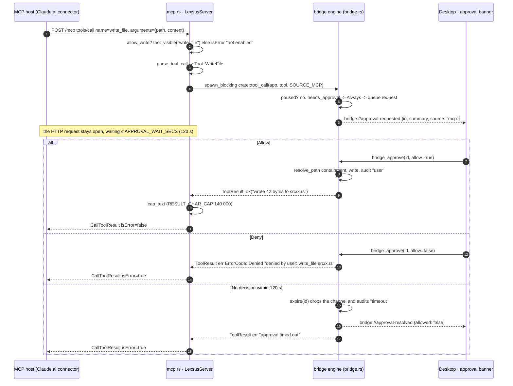

# AI Continuity Bridge — MCP Connector Protocol

## 1. Overview

Lexsus exposes its tool engine to a web AI through **one transport**: a
desktop-local **MCP server** speaking MCP **Streamable HTTP**, implemented with
`rmcp` 3.2 in `src-tauri/src/mcp.rs`. There is no browser extension and no
loopback WebSocket protocol any more. A provider reaches the tools through its
own **native MCP connector support** — Claude.ai custom connectors first — and
any MCP-capable host (Claude Code, Claude Desktop, MCP Inspector) can point
straight at the loopback URL.

| | |
|---|---|
| Transport | MCP Streamable HTTP (`rmcp` 3.2 over axum/tokio) |
| Endpoint | `http://127.0.0.1:45147/mcp` (`ADDR`, `MCP_PATH`) |
| Bind | loopback only — never a public interface |
| Auth | none at the protocol level; the loopback bind and rmcp's `Host` guard are the boundary |
| Surface | `tools/list` + `tools/call`, derived from `SPECS` in `src-tauri/src/bridge.rs` |
| Caller label | `mcp` (`bridge::SOURCE_MCP`) |
| Approval | desktop only, waits ≤ 120 s (`APPROVAL_WAIT_SECS`) |
| Result cap | 140 000 chars (`RESULT_CHAR_CAP`) |

Below the transport **nothing changed**. Every call funnels through
`crate::tool_call(&app, tool, bridge::SOURCE_MCP)` into the same policy engine:
approvals, `is_sensitive_path()`, source-scoped session grants, the kill
switch, the audit trail, `resolve_path` workspace containment, PTY safety, and
watcher grounding. The transport was replaced; the engine it feeds was not.

---

## 2. Server lifecycle and framing

`mcp::spawn_server(app, allow_write, listening)` starts a dedicated thread
holding a multi-threaded tokio runtime (`thread_name("mcp")`), so the server
never interferes with the Tauri event loop and its blocking-pool waits for
approvals cannot stall anything else.

```rust
// src-tauri/src/mcp.rs
let mut config = StreamableHttpServerConfig::default();
config.json_response = true;
config.allowed_hosts.extend(allowed_hosts_from_env());
let service = StreamableHttpService::new(factory, Arc::new(LocalSessionManager::default()), config);
let listener = tokio::net::TcpListener::bind(ADDR).await?;   // 127.0.0.1:45147
listening.store(true, Ordering::SeqCst);
let app = axum::Router::new().nest_service(MCP_PATH, service);
axum::serve(listener, app).await
```

- **Framing:** JSON-RPC over MCP Streamable HTTP. `json_response = true` makes
  the server answer a call with a single JSON body rather than holding a
  `text/event-stream` open (SEP-2567), which is what a stateless request /
  response caller wants. Sessions are tracked by `LocalSessionManager`.
- **Handler per session:** the `StreamableHttpService` factory builds a fresh
  `LexsusServer` for each connection, each sharing the same `AppHandle` and the
  same live `Arc<AtomicBool>` write flag.
- **`listening`** flips to `true` only once the socket is actually bound, and is
  what `mcp_status` reports.
- **One protocol-level error exists:** if the blocking execution task itself
  panics, the server returns `McpError::internal_error("mcp execution task
  failed")` — a JSON-RPC error, not a tool result. Every other failure below is
  a caller-visible tool error (`isError: true`), not a protocol error.

---

## 3. Reachability and the DNS-rebinding guard

The endpoint can write files and run commands, so it is bound to loopback and
is not reachable off the machine by default.

rmcp validates the inbound `Host` header, which blocks DNS-rebinding attacks
against a loopback server. The default allow-list is loopback; a tunnel or
reverse proxy forwards **its own** `Host`, so pointing a cloud provider at the
endpoint through a tunnel means either listing that host or rewriting `Host` at
the proxy.

```
LEXSUS_MCP_ALLOWED_HOSTS=lexsus-proof.trycloudflare.com,localhost.example
```

`allowed_hosts_from_env()` splits on `,`, trims, and drops empties — the extra
hosts are always **opt-in**, never hardcoded, and loopback remains allowed in
every case.

**Cloud providers.** Claude.ai runs in Anthropic's cloud and cannot dial
`127.0.0.1`. The documented way to close that gap is a **short-lived HTTPS dev
tunnel** (LocalCan or `cloudflared`) that connects *outbound* to the loopback
socket; no inbound port is opened on the developer's machine. The guardrails for
that proof — short tunnel TTL, read-only first, one bound workspace, kill switch
armed — and the full step-by-step live test are in
`docs/connector-native-proof-runbook.md`.

A **local** MCP host needs none of this: Claude Code, Claude Desktop, or MCP
Inspector points at `http://127.0.0.1:45147/mcp` directly. That is a free
byproduct of using MCP as the transport rather than a bespoke channel.

---

## 4. The tool surface — `tools/list`

The bridge's `SPECS` table (`src-tauri/src/bridge.rs`) is the single source of
truth. Each MCP descriptor is built from it:

```rust
// mcp.rs::mcp_tool — name + summary from SPECS, inputSchema from Stage 1
let summary = bridge::spec_by_name(name)?.summary;
let schema = bridge::tool_input_schema(name)?;
Tool::new_with_raw(name, Some(summary.into()), schema)
    .with_annotations(ToolAnnotations::default().read_only(read_only))
```

So every tool arrives with its SPECS one-line summary, a per-tool JSON Schema
from `bridge::tool_input_schema`, and a `readOnlyHint` annotation that a
connector's own "disable write tools" gate can rely on.

### Two surfaces

`mcp.rs` splits the canonical names into two arrays and exposes them by policy
(`exposed_names(allow_write)`, `tool_visible(name, allow_write)`):

| Surface | Ships when | Tools |
|---|---|---|
| `READ_ONLY` | always | `list_tools`, `describe_tool`, `read_file`, `list_directory`, `read_many_files`, `git_status` |
| `WRITE` | only when `allow_write` is on | `write_file`, `edit_file`, `multi_edit`, `apply_patch`, `delete_file`, `move_file`, `copy_file`, `create_directory`, `run_command` |

`READ_ONLY` is genuinely non-mutating: no row in it may carry the `Always` or
`Destructive` approval class (`read_only_surface_has_no_write_tools`), and the
two arrays must exactly partition `SPECS` with no name missing or duplicated
(`surface_partitions_all_spec_tools`).

### Implemented tools

All 15 rows of `SPECS`, with the schema's canonical argument names. Approval
classes are `Auto` / `SensitivePathOnly` / `Always` / `Destructive`.

| Tool | Required args | Optional args | Approval | Timeout |
|---|---|---|---|---|
| `read_file` | `path` | `offset`, `limit` | SensitivePathOnly | 10 s |
| `read_many_files` | `paths[]` (≤ 20) | — | Auto (sensitive paths skipped) | 15 s |
| `list_directory` | `path` | — | Auto | 10 s |
| `git_status` | — | — | Auto | 10 s |
| `write_file` | `path`, `content` | — | Always | 15 s |
| `edit_file` | `path`, `old_string`, `new_string` | `replace_all` | SensitivePathOnly | 15 s |
| `multi_edit` | `path`, `edits[]` | — | SensitivePathOnly | 20 s |
| `apply_patch` | `path`, `patch` | — | Always | 20 s |
| `copy_file` | `from`, `to` | — | Always | 10 s |
| `delete_file` | `path` | — | Destructive | 10 s |
| `move_file` | `from`, `to` | — | Destructive | 10 s |
| `create_directory` | `path` | — | Auto | 10 s |
| `run_command` | `command` | — | Always | 120 s |
| `describe_tool` | `name` | — | Auto | 5 s |
| `list_tools` | — | — | Auto | 5 s |

Timeouts are the `SPECS` `timeout_ms` values, the same ones `describe_tool`
reports. The one enforced during execution is `run_command`'s 120 s, which
kills the process group.

`describe_tool` and `list_tools` answer from the spec table alone, so they work
before a project is opened — a session that has lost the manifest can always
recover it. `tool_manifest()` renders the same table as text with no
call-looking syntax, so echoing it back into a chat cannot execute anything.

### Sample `tools/list` entry

```jsonc
{
  "name": "write_file",
  "description": "Overwrite a file with new content",
  "inputSchema": {
    "type": "object",
    "properties": {
      "path":    { "type": "string", "description": "File to overwrite" },
      "content": { "type": "string", "description": "Full new contents" }
    },
    "required": ["path", "content"],
    "additionalProperties": false
  },
  "annotations": { "readOnlyHint": false }
}
```

Schemas advertise only the **canonical** argument names — a connector should
emit those so model output stays predictable — while the parser (§5) still
tolerates aliases on the wire.

### Sample `tools/call`

```jsonc
{
  "jsonrpc": "2.0",
  "id": 12,
  "method": "tools/call",
  "params": {
    "name": "read_file",
    "arguments": { "path": "src/App.tsx", "offset": 401, "limit": 400 }
  }
}
```

Arguments arrive as a JSON object; `call_tool` converts them to a
`serde_json::Value::Object` and hands them to `bridge::parse_tool_call`, so a
given call is parsed identically no matter which MCP host sent it.

### Drift guard

The old Rust↔JS sync script is gone. The invariant "the advertised surface and
the executable surface never diverge" is now carried by Rust unit tests in
`bridge.rs` and `mcp.rs`:

- `surface_partitions_all_spec_tools` — `READ_ONLY` + `WRITE` == `SPECS`, exactly
- `read_only_surface_has_no_write_tools` — no `Always`/`Destructive` tool is read-only
- `every_exposed_tool_has_descriptor_and_schema` — every SPECS row builds a descriptor with a summary, a non-empty `inputSchema`, and a matching `readOnlyHint`
- `write_tools_hidden_until_enabled` — the gate genuinely hides the write surface

---

## 5. Argument coercion — `parse_tool_call`

`bridge::parse_tool_call(name, args)` is the one entry point for every
transport, and it stays deliberately lenient: a model guesses argument names the
way it guesses tool names.

**Name resolution.** `normalize_tool_name` strips any namespace prefix
(`default_api.read_file` → `read_file`), lowercases, and treats `-` and space
as `_`; `spec_by_name` then matches the canonical name or any alias.

| Tool | Accepted aliases |
|---|---|
| `read_file` | `read`, `view_file`, `cat`, `open_file` |
| `list_directory` | `ls`, `list_dir`, `list`, `dir` |
| `write_file` | `write`, `create_file`, `put_file` |
| `edit_file` | `edit`, `str_replace`, `replace`, `apply_edit` |
| `multi_edit` | `multi_edit_file`, `batch_edit`, `edit_many` |
| `apply_patch` | `patch`, `unified_diff` |
| `delete_file` | `remove_file`, `rm_file`, `remove` |
| `move_file` | `rename_file`, `rename`, `mv` |
| `copy_file` | `cp_file`, `duplicate_file`, `cp` |
| `create_directory` | `mkdir`, `create_dir`, `make_directory` |
| `read_many_files` | `read_files`, `read_many` |
| `run_command` | `bash`, `shell`, `execute`, `terminal`, `sh` |
| `git_status` | `status`, `git_st` |
| `describe_tool` | `tool_help`, `help`, `tool_info` |
| `list_tools` | `tools`, `available_tools` |

**Argument aliases.** "First present key wins", so a model's guess still lands:

| Tool | Accepted key sets |
|---|---|
| `edit_file` | `path`/`file`; `old_string`/`old_str`/`find`; `new_string`/`new_str`/`replace`/`replace_with` |
| `move_file`, `copy_file` | `from`/`src`/`source`; `to`/`dest`/`destination` |

**Type coercion.** The parser also lifts these, all verbatim from the wire:

- **Integers** (`offset`, `limit`) — a JSON number, or a quoted digit string
  (`"401"`), clamped to `u32::MAX`.
- **Booleans** (`replace_all`) — a real boolean, or the case-insensitive
  strings `true`/`1`/`yes` and `false`/`0`/`no`.
- **Single string → array** (`paths`) — a lone string is treated as a
  one-element array.
- **`edits[]`** (`multi_edit`) — must be an array; each item needs
  `old_string` and `new_string`, and its `replace_all` gets the same boolean
  coercion.

**Parse failures are tool errors, not protocol errors.** An unknown name
becomes `unknown tool: <name>`; a name in `SPECS` with no `parse_tool_call`
arm would read `tool not implemented: <name>`; a missing or wrong-typed
argument becomes e.g. `missing 'path' argument`. The MCP layer wraps all of
these as:

```
invalid arguments for 'write_file': missing 'path' argument
```

`additionalProperties: false` in the advertised schema is a hint to the model,
not a hard filter — the parser reads only the keys it knows and ignores the
rest.

---

## 6. The read-only / write gate

`mcp_allow_write` is an `Arc<AtomicBool>` shared with the server, **default
off**. An attached connector is read-only until someone deliberately says
otherwise.

- **Seed at launch:** `LEXSUS_MCP_ALLOW_WRITE=1` (also accepts `true`/`yes`) —
  `lib.rs::mcp_allow_write_seed`.
- **Flip live:** the `mcp_set_allow_write(enabled)` Tauri command, wired to the
  **Allow writes & commands** switch in the connector block of the bridge view.
  No rebuild, no reconnect — `allow_write` is live state, not a boot-time
  constant.

**Effect on `tools/list`:** the write tools are simply absent. A connector that
cached the list re-fetches and sees them.

**Effect on `tools/call` for a hidden tool:** the call is refused as a
caller-visible tool error, because the tool *is* known, just disabled:

```
tool 'write_file' is not enabled on this connector (write tools are disabled)
```

This is not a JSON-RPC error and does not break the session — the caller sees
`isError: true` and can adapt (or ask the human to open the gate).

---

## 7. Approval round-trip

**The desktop is the sole approval authority.** No provider exposes an approval
primitive we can rely on, so approvals live in the desktop app and nowhere
else; a connector never sees or grants one.

1. `tool_call` calls `Bridge::submit_with_audit(tool, source, root)`.
2. Three outcomes:
   - **Auto** (or covered by a session grant) — executes immediately; the audit
     row records `auto` or `grant:<scope>[:<prefix>]`.
   - **Paused** — refused before anything else with `BridgePaused`
     ("bridge paused by user — no tool calls are running"). The kill switch
     (`bridge_pause`) beats every other decision.
   - **Queued** — the request gets an id, and the desktop emits
     `bridge://approval-requested` with `{id, summary, source: "mcp",
     destructive, grantable}`. The `summary` comes from
     `describe_for_approval`, which resolves destructive paths to absolute ones.
3. The `tools/call` HTTP request **stays open** while the banner is on screen.
   The waiter is a `recv_timeout(APPROVAL_WAIT_SECS)` — 120 s, chosen to sit
   well under a hosted connector's ~300 s tool timeout so the provider never
   kills the call before the human decides. Execution itself runs on
   `tokio::task::spawn_blocking` so a pending approval never holds a runtime
   worker.
4. Outcomes:

| Desktop action | Caller receives |
|---|---|
| **Allow** | the tool executes on the desktop's thread, the audit row records `user`, and the result text comes back in the same open response |
| **Deny** | an error result: `denied by user: <summary>` (`ErrorCode::Denied`) |
| **No decision within 120 s** | an error result `approval timed out`; `Bridge::expire(id)` dequeues the request and drops its channel, audits `timeout`, and emits `bridge://approval-resolved` so the stale card disappears — a late Allow then resolves nothing instead of running the tool with nobody watching |
| **Bridge paused** | `BRIDGE_PAUSED` before the call reaches the engine |

**Session grants** are offered as a checkbox on the card ("don't ask again for
edits under `src/` this session"). They are **source-scoped**: a grant created
by an `mcp` call covers only `mcp` calls, never `desktop` or `web` ones, and
vice versa. A grant never covers a destructive tool, never covers a sensitive
path, and its path prefix is validated through `resolve_path`, not a raw
`starts_with`, so a `..`-laden path cannot widen its own scope. Revoking a
grant, or pausing the bridge, happens only in the desktop UI.

**Source labels.** `SOURCE_DESKTOP` (`desktop`) and `SOURCE_MCP` (`mcp`) are
recorded on every audit row and grant. `mcp` is the remote caller; `desktop` is
the in-app sandbox and the approval authority. The extension-era `web` label is
gone along with the transport that set it — a tool call can now originate from
exactly one remote source.

---

## 8. Results, caps and truncation markers

The tool output is passed through verbatim — the markers a model sees are the
tool's own — and then capped once at the MCP boundary.

**The cap:** `cap_text` truncates any result over `RESULT_CHAR_CAP` =
**140 000 chars** (chars, not bytes), keeping the existing "cut and say so"
convention:

```
… [output truncated at 140000 chars — call read_file with an offset to continue]
```

The cap exists because hosted connectors have a result ceiling around 150k
chars; the connector must never hand a provider an unbounded blob.

**Markers produced inside the tools** (all well under the cap and unchanged by
it):

| Tool | Marker |
|---|---|
| `read_file` | pages rather than truncates — `[chunk 2 of 3 · lines 401-800 of 1000 · 15.1 KB of 36.2 KB]` then `[to continue, call: read_file("src/App.tsx", 801)]`, or `[end of file]` on the last chunk |
| `run_command` | `[output truncated]` at the 1 MB output budget, `[timed out — process killed]` (+ `COMMAND_TIMEOUT`), and always `[exit code: N]` |
| `read_many_files` | `[path — skipped: sensitive]`, `[path — batch budget spent; call read_file on it]`, `[N of M files shown]` |
| `list_directory` | `[N entries]` |
| `git_status` | `[N changed files]`, or `working tree clean` |

`read_file` chunks at `CHUNK_LINES` = 400 lines and `CHUNK_BYTES` = 16 KB,
whichever comes first — except that a single line longer than 16 KB is still
returned whole, so a minified bundle makes progress instead of looping on the
same offset. `offset` is clamped to the last line rather than rejected: the
model is guessing at file length, and a hard error on a stale offset would
strand it mid-file. The file itself must be under `READ_CAP` = 16 MiB
(`FILE_TOO_LARGE`, checked from metadata so an oversized file is never loaded).

---

## 9. Error codes

`bridge::ErrorCode` is the vocabulary for failures. Over MCP a failure is a
`CallToolResult` with `isError: true` whose text is the human message; the
structured code is what lands in the audit row and the desktop activity trace.

| Code | Raised when | Retry |
|---|---|---|
| `FILE_NOT_FOUND` | path does not exist (or its parent could not be resolved) | No |
| `FILE_IS_BINARY` | the file contains NUL bytes | No |
| `FILE_TOO_LARGE` | file ≥ `READ_CAP` (16 MiB) | No |
| `PATH_ESCAPES_ROOT` | `resolve_path` finds the target outside the bound workspace (containment refusal) | No |
| `INVALID_ARGUMENTS` | malformed call, e.g. `read_file` on a directory, > 20 paths in a batch | No |
| `STRING_NOT_FOUND` | `edit_file`/`multi_edit` old string matched nothing | No |
| `AMBIGUOUS_MATCH` | matched several times without `replace_all`; the message names the count | No |
| `PATCH_DOES_NOT_APPLY` | a hunk's context matches nowhere (±20-line drift search); the file is left untouched | No |
| `BRIDGE_PAUSED` | the desktop kill switch is on | No |
| `DENIED` | the desktop denied the approval, or the 120 s window expired | No |
| `EXECUTION_FAILED` | IO/shell/git failure while carrying out a permitted call | Maybe |
| `COMMAND_TIMEOUT` | `run_command` hit its 120 s wall and killed the process group | Maybe |
| `UNKNOWN_TOOL` | `describe_tool` naming a tool that does not exist | No |
| `INTERNAL_ERROR` | no project root bound ("project root not set") | No |

Containment and sensitivity are the two refusal classes worth calling out:

- **Containment.** Every path is resolved by `resolve_path` against the bound
  `project_root`, realpath-checked for existing targets and lexically
  normalized for new ones, so `notes/../../../.bashrc` is `PATH_ESCAPES_ROOT`
  rather than an escape. The workspace is the connector's whole blast radius.
- **Sensitivity.** A read of a sensitive path (`.env*`, `id_rsa`,
  `credentials`, `secret`, `token`, `password`, `api_key`, `.npmrc`,
  `.gitconfig`, `.netrc`, `.git/config`, or a `.pem`/`.key`/`.pfx`/`.p12`/
  `.ppk`/`.crt` extension) is not refused outright — it is escalated to the
  desktop banner. The denial the caller sees is `DENIED`. Copying a secret to
  an innocuous name does not launder it: `tool_paths` returns both sides of a
  `move_file`/`copy_file`.

`ErrorCode` also carries `PERMISSION_DENIED` and `SENSITIVE_PATH` as reserved
policy vocabulary; no code path constructs them today. The transport-era codes
(`MALFORMED_JSON`, `CONNECTION_LOST`, `NOT_PAIRED`) were removed along with the
WebSocket transport that raised them — the connector rejects a malformed
request at the JSON-RPC layer before it reaches the engine.

---

## 10. Sequence diagram — a gated `write_file` over MCP



A **sensitive read** takes the same path with the gate already open: the call
is queued instead of executed, and the banner is the only thing standing
between the connector and the file. An **auto** call (`list_tools`,
`git_status`, a non-sensitive `read_file`) skips the engine's queue entirely and
returns in one round trip.

---

## 11. Connector state — `mcp_status`

The desktop polls `mcp_status` on mount; it is the single source of truth for
what the connector currently is:

```jsonc
{
  "listening": true,                      // the loopback socket is bound
  "endpoint": "http://127.0.0.1:45147/mcp",
  "allow_write": false,                   // the live write gate
  "workspace": "/home/me/code/project"    // null until a project is bound
}
```

`mcp_set_allow_write` returns the same payload after flipping the gate, so the
UI never has to guess. The status bar renders `connector · ro` /
`connector · rw` / `connector offline` from `listening` + `allow_write`.

---

## 12. What this protocol deliberately does not do

- **No push.** MCP is pull-based, so there is no way to inject a handoff into a
  chat, and none is attempted. A handoff is surfaced in-app
  (`failover://local`) and copied to the clipboard from the Handoff view. A
  `get_handoff` **pull tool** is the planned replacement — it is not built.
- **No `cancel` frame.** A long `run_command` is cancelled from the desktop
  (`cancel_request(owner)`), which SIGTERMs the process group of the request
  that spawned it (SIGKILL after a 500 ms grace). Dropping the HTTP connection
  does *not* kill a running command.
- **No streaming into the connector.** `run_command` output streams to the
  desktop terminal pane as `terminal://run` events while it runs; the MCP
  caller gets the final text once, subject to the cap.
- **No tool-call detection.** There is no text scanner and no DOM to watch:
  the model calls tools because its own MCP client advertised them. Anything
  about fenced blocks, `<acb_tool>` tags, composer injection, or dedup of
  scraped text is gone with the extension.
- **No search tools.** `search_files`/`grep`, `glob`, and the `git_*` write
  tools are still roadmap items (`docs/tool-roadmap.md`) and are absent from
  `SPECS`, so they never appear in `tools/list`. An unknown name is refused as
  an invalid-arguments tool error.
- **No OAuth.** Authentication is the loopback bind plus the `Host` guard. A
  stable public host behind the product gate would need OAuth 2.1 + PKCE; none
  is implemented.
